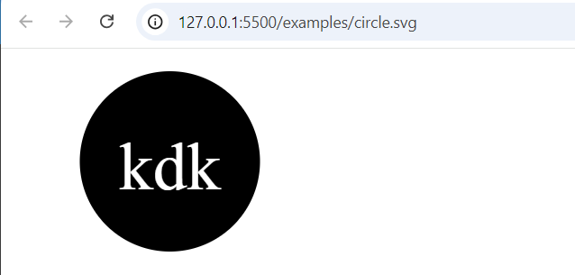

# SVG Logo Maker

## Description

This project is a SVG Logo Maker that enables users to easily generate custom logos in a separate SVG file. Utilizing the Inquirer library, the user is prompted with a series of questions to gather input data, such as the text, colors, and shapes. That user data is then used to generate their own personalized logo.

To ensure the functionality and accuracy of each shape, the Jest testing framework was used to perform unit tests, guaranteeing the correct rendering of the logo components.

This tool provides a user-friendly and efficient way to create high-quality logos through a command-line interface.

## Table of Contents

- [Installation](#installation)
- [Usage](#usage)
- [Credits](#credits)
- [License](#license)

## Installation

Use npm i to download the dependencies.

## Usage

<a href="https://drive.google.com/file/d/1KwjpWUhDwKb7l37Ic4dsWz7I9cvxckrv/view?usp=sharing">How to Use</a> 

## Credits

<a href="https://coding-boot-camp.github.io/full-stack/github/professional-readme-guide">README Format</a> 

<a href="https://gist.github.com/lukas-h/2a5d00690736b4c3a7ba">License Page</a> 

<a href="https://static.fullstack-bootcamp.com/fullstack-ground/module-10/circle.svg">Circle reference</a>

<a href="https://developer.mozilla.org/en-US/docs/Web/SVG/Tutorial/Basic_Shapes">Square reference</a>

<a href="https://developer.mozilla.org/en-US/docs/Web/SVG/Tutorial/Texts">Text reference</a>

## License

